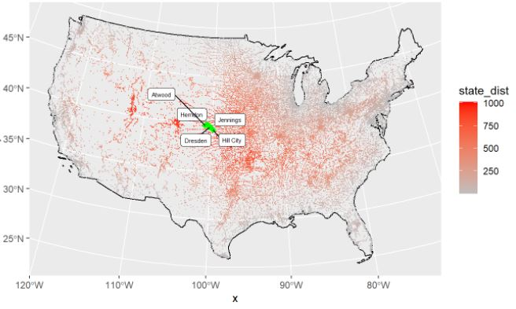

## [Lab 2 - Data Wrangling](https://mattdecambra.github.io/176A-labs/lab-02.html)
 
- In this lab we learned to filter/wrangle through large data sets, in this case a New York times COVID-19 dataset.
- Learned to mutate and use dply verbs to create rolling means, averages, daily new cases, etc. 
- Learned to use Knitr in order to create tables that display our filtered data. 
 
{width=30%}

 

## [Lab 3 - Distances and Projections](https://mattdecambra.github.io/176A-labs/lab-03.html)
 
- Learned about the sf, sfc, and sfg features and objects and applied them to the United States.
- Applied our knowledge to calucluate distances
- Mapped the cities that were equidistance between Canadian and Mexican border
 
{width=30%}

 

## [Lab 4 - Tesselations, Spatial Joins, and Point-in-Polygon](https://mattdecambra.github.io/176A-labs/lab-04-matt.html)
- I explored the impacts of tessellated surfaces and the modifiable areal unit problem (MAUP) using the National Dam Inventory maintained by the United States Army Corps of Engineers
- Applied the different tessellations and coverages to our data.
- Learned to create and use functions within this problem.
 
{width=30%}

 

## [Lab 5 - Raster Analysis](https://mattdecambra.github.io/176A-labs/lab-05.html)
- Learned to apply our knowledge in R to different remote sensing techniques, like classifications, and thresholding.
- Learned to create our own unique band combinations to RGB
- Applied raster algebras to our different combonations.
 
{width=30%}

 

## [Lab 6 - Terrain Analysis](https://mattdecambra.github.io/176A-labs/lab-06-mat.html)
- Wrangling data into R using Web APIs
- Carrying out a simple, multi-data structure (raster/vector) analysis.
- Learned to plot this flooding as water gets higher. 
 
{width=30%}
