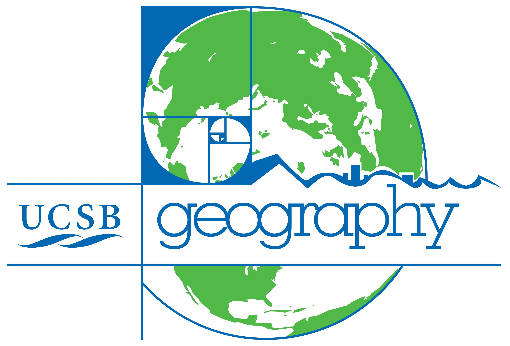
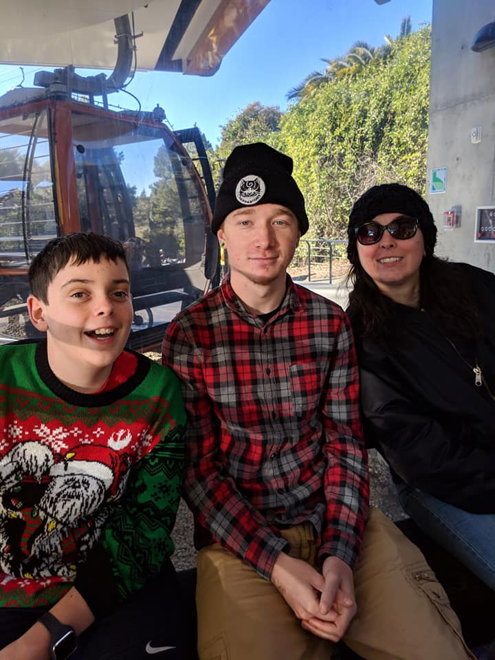

  
## About Me

---

-During the two years at UCSB I have gained a lot of knowledge that will help me succeed in a professional setting. I worked a complete year with remote sensing and how to apply it to real world issues and problems. I also spent a year learning and using different GIS API such as ARC GIS, QGIS. On top of this I was able to learn how to use R and apply it to these same special problems. If any of these skills are of use to you and would like to bring me in for an interview, you can reach me at mattdecambra@gmail.com 
 
 
 
 
 

